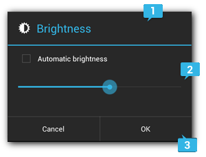
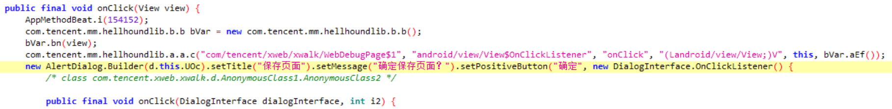
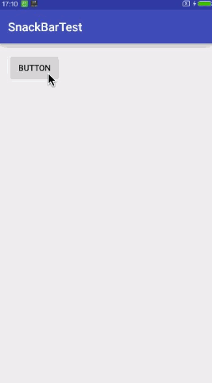
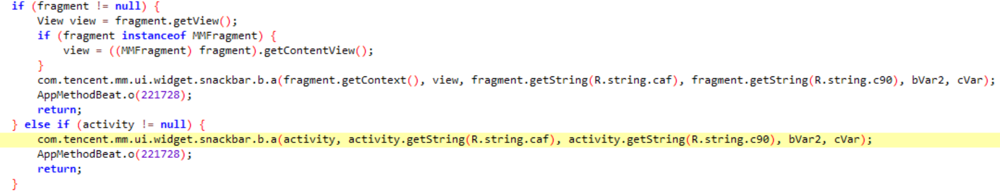
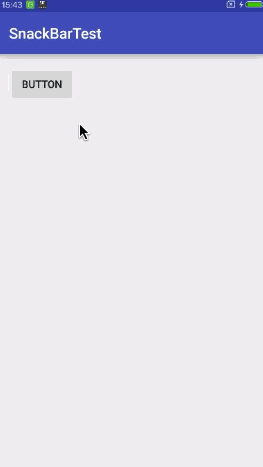
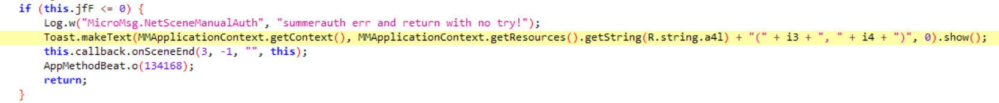
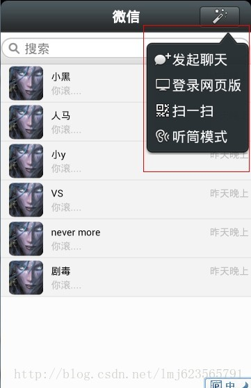
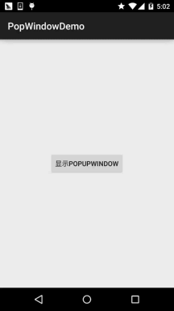
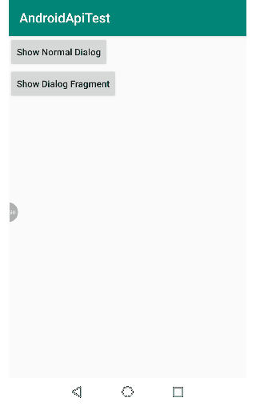
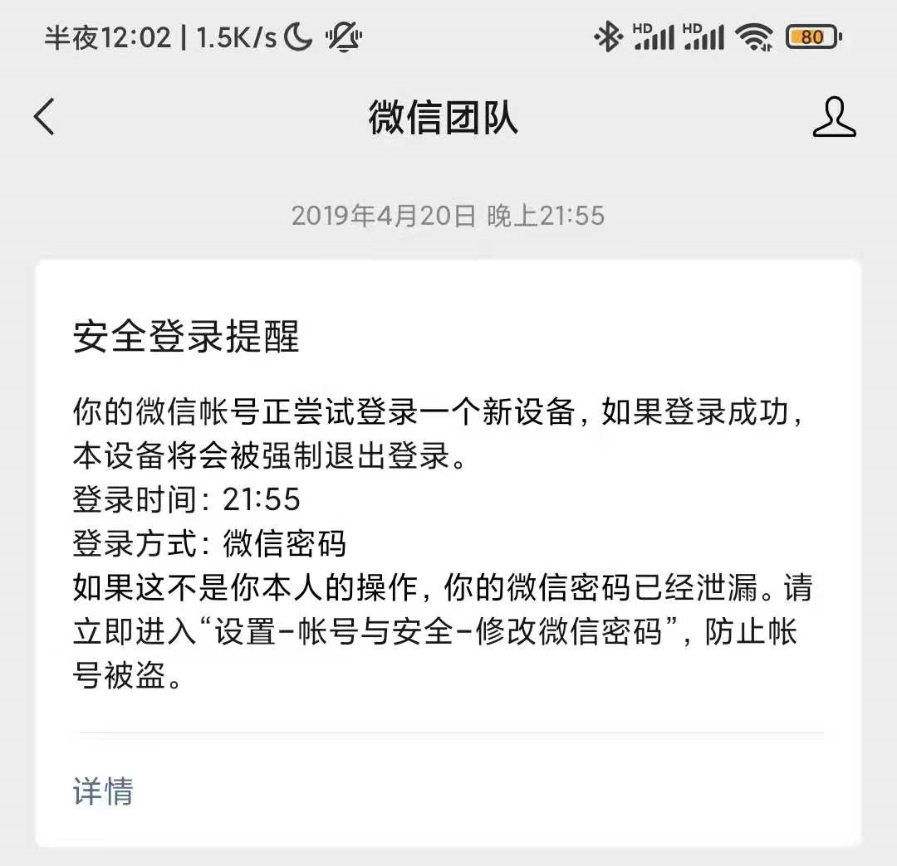

# 关于弹出提示的调查


## 1. dialog


Dialog是对话框的基类，有以下子类之一：`AlertDialog`、`DatePickerDialog` 、 `TimePickerDialog`

只有`AlertDialog`适合用于免疫警告

| [kotlin.Any](https://kotlinlang.org/api/latest/jvm/stdlib/kotlin/-any/index.html) |                                                              |                                                              |                                                              |
| ------------------------------------------------------------ | ------------------------------------------------------------ | ------------------------------------------------------------ | ------------------------------------------------------------ |
| ↳                                                            | [android.app.Dialog](https://developer.android.google.cn/reference/android/app/Dialog.html) |                                                              |                                                              |
|                                                              | ↳                                                            | [androidx.appcompat.app.AppCompatDialog](https://developer.android.google.cn/reference/kotlin/androidx/appcompat/app/AppCompatDialog) |                                                              |
|                                                              |                                                              | ↳                                                            | [androidx.appcompat.app.AlertDialog](https://developer.android.google.cn/reference/kotlin/androidx/appcompat/app/AlertDialog?hl=en#) |


`AlertDialog`级允许你建立各种对话设计的，而且往往你唯一需要的对话框类。警报对话框分为三个区域：



1. 标题

   这是可选的，仅当内容区域被详细消息、列表或自定义布局占用时才应使用。如果您需要陈述一个简单的消息或问题（例如图 1 中的对话框），则不需要标题。

2. 内容区

   这可以显示消息、列表或其他自定义布局。

3. 操作按钮

   一个对话框中的操作按钮一般不超过三个。

### 示例代码：

- 只有标题和内容

```java
AlertDialog alertDialog1 = new AlertDialog.Builder(this)
        .setTitle("这是标题")//标题
        .setMessage("这是内容")//内容
        .setIcon(R.mipmap.ic_launcher)//图标
        .create();
alertDialog1.show();
```

- 选项

```java
new AlertDialog.Builder(this).setMultiChoiceItems //创建多选框
new AlertDialog.Builder(this).setPositiveButton //设置按钮

```

- 单独写一个类的方式
```java
//调用
Message message = Message.obtain(handler);
WeiListenRecordingStudioFileSaveDialog dlog = new WeiListenRecordingStudioFileSaveDialog(this, getResources(),
mTitle, message);
dlog.show();
 
========
 
//自定义类
public class WeiListenRecordingStudioFileSaveDialog extends Dialog {
public WeiListenRecordingStudioFileSaveDialog(Context context,
                          Resources resources,
                          String originalName,
                          Message response) {
        super(context);
		
		//背景透明处理
        getWindow().requestFeature(Window.FEATURE_NO_TITLE);
        getWindow().setFlags(WindowManager.LayoutParams.FLAG_LAYOUT_IN_SCREEN,
                WindowManager.LayoutParams.FLAG_LAYOUT_IN_SCREEN);
        getWindow().setBackgroundDrawable(new ColorDrawable(Color.TRANSPARENT));
        getWindow().setDimAmount(0f);
 
        // Inflate our UI from its XML layout description.
        setContentView(R.layout.wei_listen_recording_studio_file_save);
}}
```


- 微信中的例子



### 特征

（1）包含多个字符串

根据参数类型：一般的弹窗有标题和内容，注意出现两个字符串的语句，可能是弹窗

AlertDialog接口较多，一个实例下初始化多个内容并包含字符串的可能是弹窗

（2）可能包含AlerDialog关键字

（3） 调用的类是dialog的子类


## 2. Snackbar

snackbar是介于Dialog和Toast中间的一个控件。Snackbar和Toast比较相似，但是用途更加广泛，并且它是可以和用户进行交互的。Snackbar使用一个动画效果从屏幕的底部弹出来，过一段时间后也会自动消失。

| java.lang.Object |                                                              |                                               |
| ---------------- | ------------------------------------------------------------ | --------------------------------------------- |
| ↳                | [com.google.android.material.snackbar.BaseTransientBottomBar](https://developer.android.google.cn/reference/com/google/android/material/snackbar/BaseTransientBottomBar) < [com.google.android.material.snackbar.Snackbar](https://developer.android.google.cn/reference/com/google/android/material/snackbar/Snackbar) > |                                               |
|                  | ↳                                                            | com.google.android.material.snackbar.Snackbar |

### **示例代码：**

```java
Snackbar.make(view, "data deleted",Snackbar.LENGTH_LONG)
        .setAction("Undo", new View.OnClickListener(){
                @Override
                public void onClick(View v) {
                }
            })
        .show();
```




有的APP中通常会使用定制的snackbar控件，例如微信

微信中的定制的snackbar



```xml
<string name="caf">已收藏</string>
<string name="c90">添加标签</string>
```

效果：


### **特征**

（1）一般含有参数view 

（2）包含字符串 （直接 或者在 资源文件中）

（3）可能有snackbar关键字


## 3. Toast

Toast只会弹出一段信息，告诉用户某某事情已经发生了，过一段时间后就会自动消失。它完全不会阻挡用户的任何操作，甚至用户也可以完全不用理会Toast。

| [java.lang.Object](https://developer.android.google.cn/reference/java/lang/Object) |                      |
| ------------------------------------------------------------ | -------------------- |
| ↳                                                            | android.widget.Toast |

### **示例代码：**

```java
    Toast.makeText(context, "things happened", Toast.LENGTH_SHORT).show();
```



- **一些包装过的toast**

```java
public class Util {

    private static Toast toast;

    public static void showToast(Context context, 
        String content) {
        if (toast == null) { 			//避免t重复点击后toast持续出现 
            toast = Toast.makeText(context,
                         content, 
                         Toast.LENGTH_SHORT);
        } else {
            toast.setText(content);
        }
        toast.show();
    }

}
```

- **使用：**

```java
Util.showToast(context, "things happened");
```

- 微信中的例子：



```xml
<string name="a41">[转账] 已取消</string>
```


### 特征

（1）一般含有参数context

（2）包含字符串 （直接 或者在 资源文件中）

（3）可能有toast关键字


## 4. Activity 伪弹窗

Activity作为弹出对话框，显示的位置可以灵活多变

包

 androidx.activity

- 例子



- 调用举例

```java
Intent intent = new Intent(context, MainWeixinTitleRightActivity.class);
startActivity(intent);
```

### 特征

（1）清单文件中可以找到

这种弹窗方式的特征是在资源文件下存放了弹窗相关的信息，在layout和xml文件中存放了弹窗的相关属性：位置，大小等。这种弹窗的文本信息需要先找到弹窗位置之后再到resources文件中寻找。

（2）代码量相对多 

一般不适用于免疫提示

## 5. PopupWindow弹窗

展示view的弹出窗体，这个弹出窗体将会浮动在当前activity的最上层，这个和免疫相关的弹窗机制十分类似,输出的内容一般存放在contentview变量中

| [kotlin.Any](https://kotlinlang.org/api/latest/jvm/stdlib/kotlin/-any/index.html) |                                                              |
| ------------------------------------------------------------ | :----------------------------------------------------------- |
| ↳                                                            | [android.widget.PopupWindow](https://developer.android.google.cn/reference/kotlin/android/widget/PopupWindow?hl=en#) |

- 调用举例

```java
TestPopupWindow mWindow = new TestPopupWindow(this);
PopupWindowCompat.showAsDropDown(mWindow, mButtom, 0, 0, Gravity.START);
```

- 例子




### 特征

（1）一般含有参数view 

这种方法的特征是弹窗前会先检测之前设置的contentview的大小,因此除了搜索方法之外，还可以搜索window.getContextView附近的语句来筛选一部分。

（2）有对应的布局文件

在项目目录的res下layout里面，包含有对应的布局xml文件。没有显式字符串参数，相关的字符串需要在resources文件中寻找

```java
int offsetX = window.getContentView().getMeasuredWidth();
int offsetY = 0;
PopupWindowCompat.showAsDropDown(window, mButton, offsetX, offsetY, Gravity.START);
```

（3）可能有 PopupWindow关键字


## 6. Fragment弹窗


| [kotlin.Any](https://kotlinlang.org/api/latest/jvm/stdlib/kotlin/-any/index.html) |                                                              |                                                              |
| ------------------------------------------------------------ | ------------------------------------------------------------ | ------------------------------------------------------------ |
| ↳                                                            | [androidx.fragment.app.Fragment](https://developer.android.google.cn/reference/kotlin/androidx/fragment/app/Fragment) |                                                              |
|                                                              | ↳                                                            | [androidx.fragment.app.DialogFragment](https://developer.android.google.cn/reference/kotlin/androidx/fragment/app/DialogFragment?hl=en#) |

DiaglogFragment是一个类，对类中成员赋值之后就可以设置弹窗内容，背景等。

是dialog的另一种实现形式，与一般的AlertDialog相比，DialogFragment在Activity销毁重建时会自动重建，而AlertDialog不会。（例如横竖屏切换时）



```java
public class LoginDailog extends DialogFragment implements View.OnClickListener {
 
    public static final String USERNAME = "userName";
    public static final String USERPASSWORD = "userPassword";
    ····

```

### **特征**

（1）一般含有参数view 

（2）包含字符串 （直接 或者在 资源文件中）

（3）可能有Fragment关键字

## 7. notification

通知的免疫就非常广泛，比如下面这个，如果作为通知出现在手机上，也可以是一种免疫。但是这类的免疫发生很可能不是由本地的设备状态所决定的，可能是由服务器下发。从字符出发可能难以找到对应的关键字。

| [kotlin.Any](https://kotlinlang.org/api/latest/jvm/stdlib/kotlin/-any/index.html) |                                                              |
| ------------------------------------------------------------ | ------------------------------------------------------------ |
| ↳                                                            | [android.app.Notification](https://developer.android.google.cn/reference/kotlin/android/app/Notification?hl=en#) |




# 关于string位置的调查

## 1. 代码中显示存放


## 2.资源文件中strings.xml


## 3.加密或者组合

